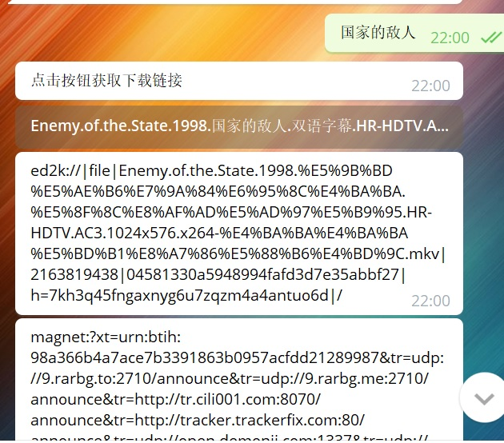
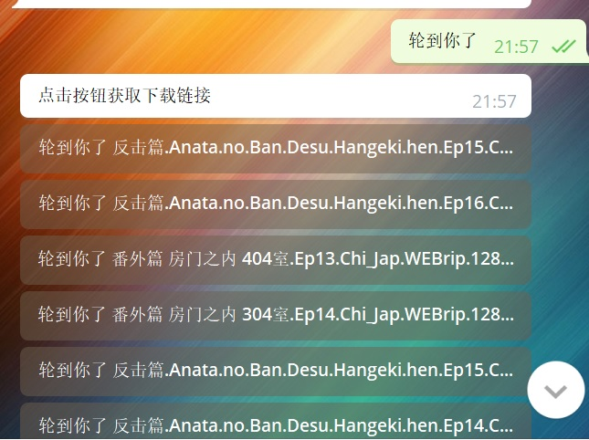

# YYeTsBot
人人影视bot，[戳我使用](https://t.me/yyets_bot)

# 使用说明
直接发送想要看的剧集名称就可以了，会返回ed2k和磁力链接

# 截图





# 部署方法
## 1. 环境
推荐使用Python 3，Python 2未进行测试，使用pip安装依赖
```bash
pip install requests pytelegrambotapi beautifulsoup4 lxml
```
## 2. 配置TOKEN
修改`config.py`，把TOKEN修改为你的bot token
## 3. 克隆&运行
```bash
git clone https://github.com/BennyThink/YYeTsBot
python /path/to/YYeTsBot/bot.py
```
## 4. systemd 单元文件
```bash
[Unit]
Description=A Telegram Bot for YYeTs
After=network.target network-online.target nss-lookup.target

[Service]
User=nobody
Group=nobody
Restart=on-failure
Type=simple
ExecStart=/usr/bin/python /home/YYeTsBot/bot.py

[Install]
WantedBy=multi-user.target
```

# Credits
* [人人影视](http://www.zmz2019.com/)
* [追新番](http://www.zhuixinfan.com/main.php)
* [FIX字幕侠](http://www.zimuxia.cn/)
* [磁力下载站](http://oabt005.com/home.html)

# License
[MIT](LICENSE)