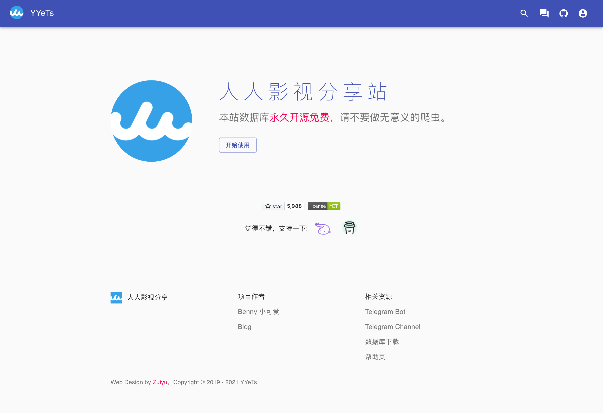
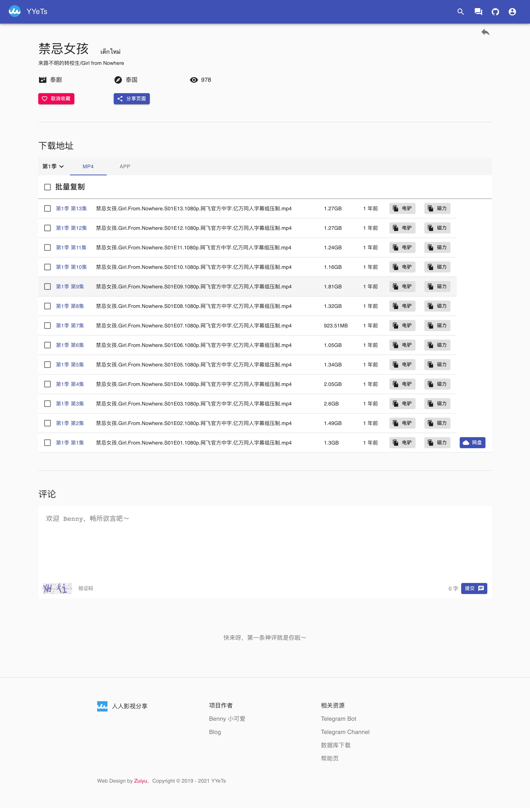
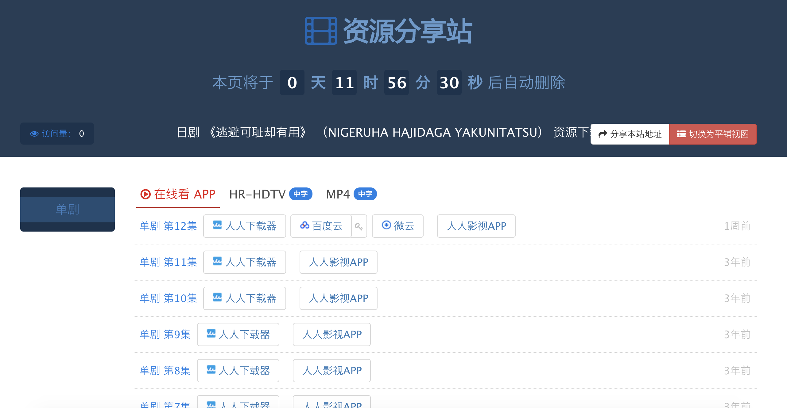
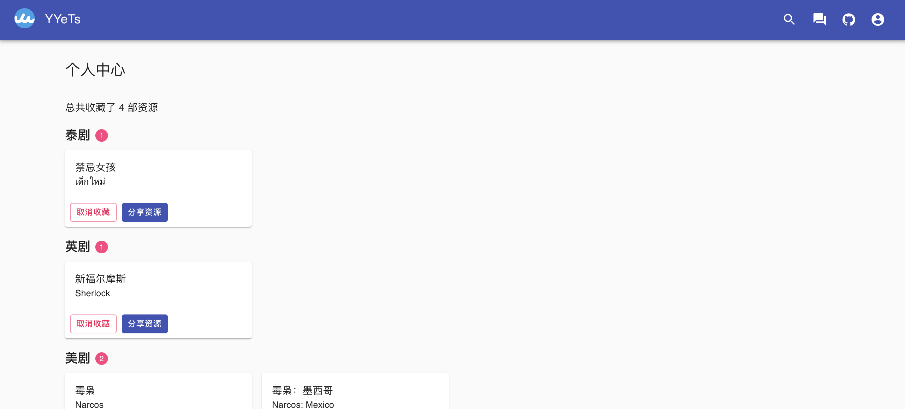

# YYeTsBot

[](https://github.com/tgbot-collection/YYeTsBot/actions/workflows/docker.yaml)
[](https://hub.docker.com/r/bennythink/yyetsbot)



👉 前端[在这里](https://github.com/tgbot-collection/YYeTsFE) 👈

# bot 使用说明

直接发送想要看的剧集名称就可以了，可选分享网页或者链接（ed2k和磁力链接）。


搜索资源时，会按照我预定的优先级（人人影视离线、字幕侠）进行搜索，当然也可以使用命令强制某个字幕组，如 `/yyets_offline 逃避可耻`

## 命令

```
start - 开始使用
help - 帮助
credits - 致谢
ping - 运行状态
settings - 获取公告
zimuxia_online - 字幕侠在线数据  
newzmz_online - new字幕组在线数据 
yyets_offline - 人人影视离线数据
```

# 截图

## 常规搜索


## 资源分享站截图

本网站永久免费，并且没有任何限制。




支持收藏功能，会跨设备同步


## 指定字幕组搜索

目前只支持YYeTsOffline、ZimuxiaOnline和NewzmzOnline


# 如何下载磁力和电驴资源？迅雷提示资源敏感

## 电驴资源

请下载使用 [eMule](https://www.emule-project.net/home/perl/general.cgi?l=42) ，然后添加如下两个server list

* [server.met](http://www.server-met.de/)
* [server list for emule](https://www.emule-security.org/serverlist/)


速度还可以哦

## 磁力

使用百度网盘、115等离线，或使用utorrent等工具，记得更新下 [tracker list](https://raw.githubusercontent.com/ngosang/trackerslist/master/trackers_all.txt)
哦


# Python Library

也可以作为Python Library去调用

`pip3 install yyets`

```
>>> from yyets import YYeTs
>>> yy=YYeTs("逃避")
[2021-09-21 19:22:32 __init__.py:54 I] Fetching 逃避可耻却有用...https://yyets.click/api/resource?id=34812
[2021-09-21 19:22:33 __init__.py:54 I] Fetching 无法逃避...https://yyets.click/api/resource?id=29540
[2021-09-21 19:22:35 __init__.py:54 I] Fetching 逃避者...https://yyets.click/api/resource?id=37089

>>> yy.result
[<yyets.Resource object at 0x10cc7b130>, <yyets.Resource object at 0x10ca0e880>, <yyets.Resource object at 0x10cc7b040>]

>>> for y in yy.result:
        print(y)
    
逃避可耻却有用 - NIGERUHA HAJIDAGA YAKUNITATSU
无法逃避 - Inescapable
逃避者 - Shirkers

>>> yy.result[0].cnname
'逃避可耻却有用'

>>> yy.result[0].list
[{'season_num': '101', 'season_cn': '单剧', 'items': {'APP': [{'ite
```

# Credits

* [人人影视](http://www.zmz2019.com/)
* [追新番](http://www.fanxinzhui.com/)
* [FIX字幕侠](https://www.zimuxia.cn/)
* [new字幕组](https://newzmz.com/)

# 支持我

觉得本项目对你有帮助？你可以通过以下方式表达你的感受：

* 感谢字幕组
* 点一个star 和fork
* 宣传，使用，提交问题报告
* 收藏[我的博客](https://dmesg.app/)
* [Telegram Channel](https://t.me/mikuri520)

## 捐助

* [给我买杯咖啡？](https://www.buymeacoffee.com/bennythink)
* [GitHub Sponsor](https://github.com/sponsors/BennyThink)
* [Stripe](https://buy.stripe.com/dR67vU4p13Ox73a6oq)

 


# License

[MIT](LICENSE)
