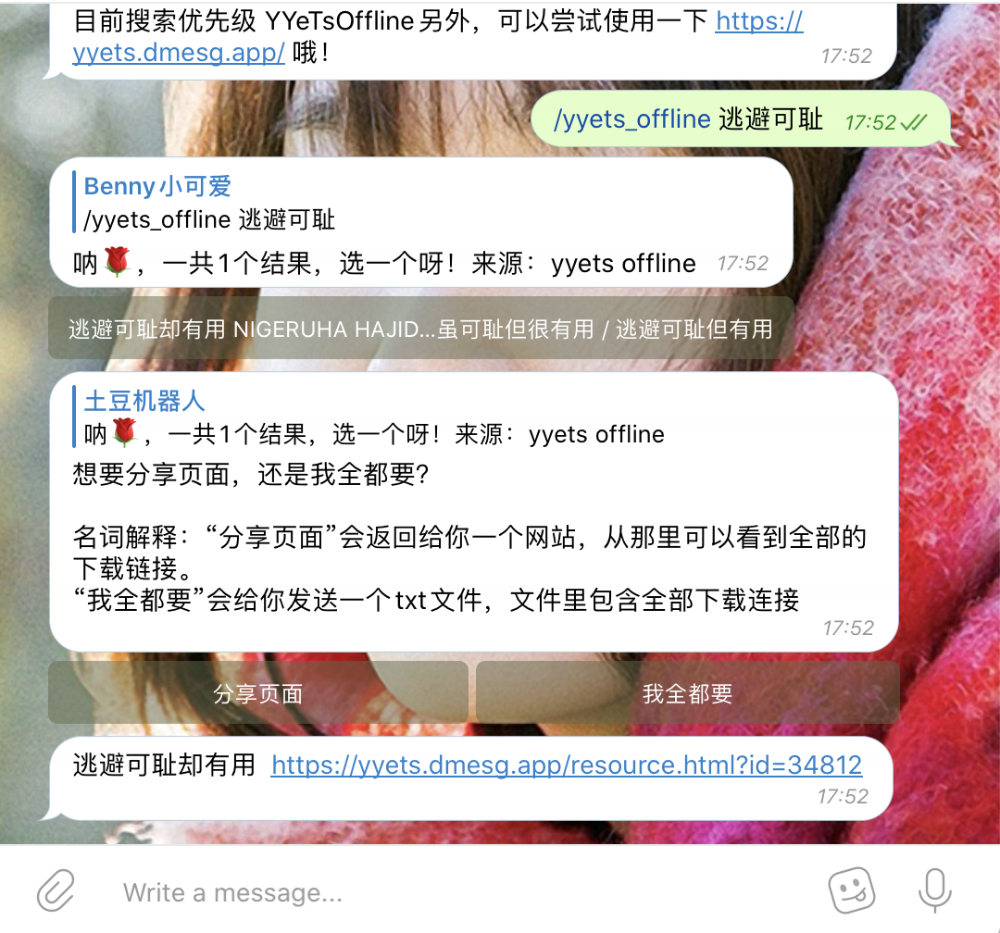

# YYeTsBot

[](https://travis-ci.com/tgbot-collection/YYeTsBot)

[](https://codecov.io/gh/tgbot-collection/YYeTsBot)

* 人人影视bot，[戳我使用](https://t.me/yyets_bot)

* 人人影视分享站，[戳我使用](https://yyets.dmesg.app/)

机器人和网站由我长期维护，如果遇到问题可以提issue。


👉 前端[在这里](https://github.com/wyx1818/YYeTsFE) 👈

# 使用说明

直接发送想要看的剧集名称就可以了，可选分享网页或者链接（ed2k和磁力链接）。

支持字幕侠、人人影视离线资源

搜索资源时，会按照我预定的优先级（人人影视离线、字幕侠）进行搜索，当然也可以使用命令强制某个字幕组，如 `/yyets_offline 逃避可耻`

**由于译名的不同，建议输入部分译名，然后从列表中进行选择。比如说想看权力的游戏第四季，那么直接搜索"权力的游戏"就可以了。**

## 命令
```
start - 开始使用
help - 帮助
credits - 致谢
ping - 运行状态
settings - 获取公告
zimuxia_offline - 字幕侠离线数据
zimuxia_online - 字幕侠在线数据  
yyets_online - 人人影视在线数据  
yyets_offline - 人人影视离线数据
```

# 截图

## 常规搜索


## 资源分享站截图
本网站永久免费，并且没有任何限制。


支持收藏功能，会跨设备同步


## 指定字幕组搜索

目前只支持YYeTsOffline和ZimuxiaOnline



# 如何下载磁力和电驴资源？迅雷提示资源敏感
## 电驴资源
请下载使用 [eMule](https://www.emule-project.net/home/perl/general.cgi?l=42) ，然后添加如下两个server list
* [server.met](http://www.server-met.de/)
* [server list for emule](https://www.emule-security.org/serverlist/)


速度还可以哦

## 磁力
使用百度网盘、115等离线，或使用utorrent等工具，记得更新下 [tracker list](https://raw.githubusercontent.com/ngosang/trackerslist/master/trackers_all.txt) 哦

# 小白使用
想要自己留一份资源，但是又不懂编程？
没关系！请到 [GitHub Release](https://github.com/tgbot-collection/YYeTsBot/releases) 根据自己平台下载一键运行包！

* Windows用户双击 `start_windows.bat` 
* macOS 在终端中执行 `bash start_unix.sh`

打开浏览器 http://127.0.0.1:8888 就可以看到熟悉的搜索界面啦！

# 开发

如何参与开发、具体API接口，可以 [参考这个文档](DEVELOPMENT.md)

# Credits

* [人人影视](http://www.zmz2019.com/)
* [追新番](http://www.zhuixinfan.com/main.php)
* [磁力下载站](http://oabt005.com/home.html)
* [FIX字幕侠](https://www.zimuxia.cn/)

# 支持我

觉得本项目对你有帮助？你可以通过以下方式表达你的感受：

* 感谢字幕组
* 点一个star🌟和fork🍴
* 宣传，使用，提交问题报告
* 收藏[我的博客](https://dmesg.app/)
* [Telegram Channel](https://t.me/mikuri520)
* 捐助我，[给我买杯咖啡？](https://www.buymeacoffee.com/bennythink)
* 捐助我，[爱发电？](https://afdian.net/@BennyThink)

# 感谢
感谢所有支持本项目的人！

# License
[MIT](LICENSE)
